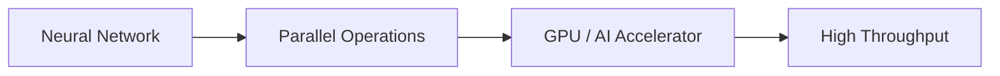
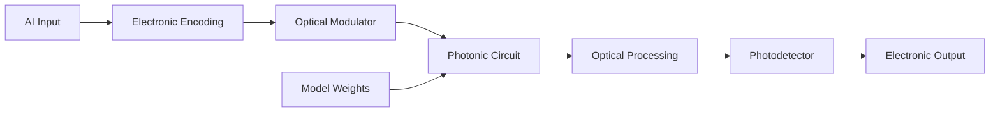
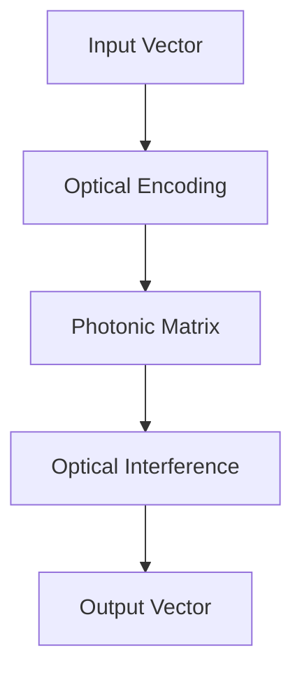
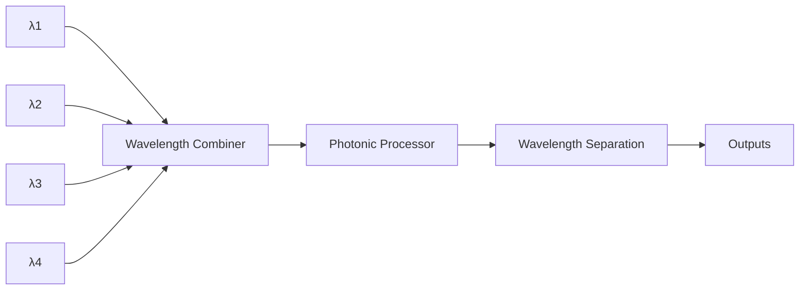
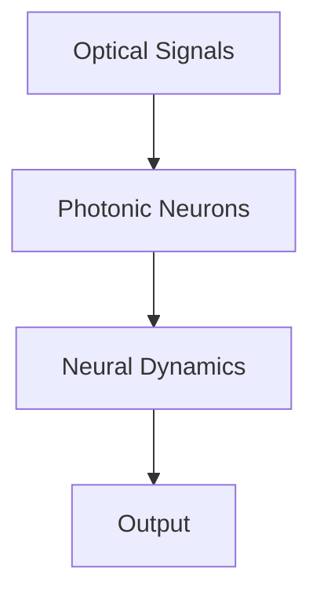
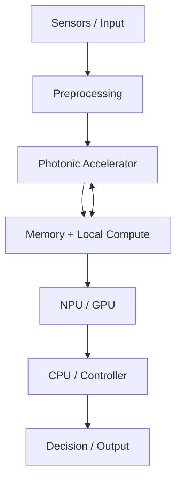
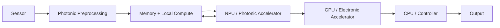
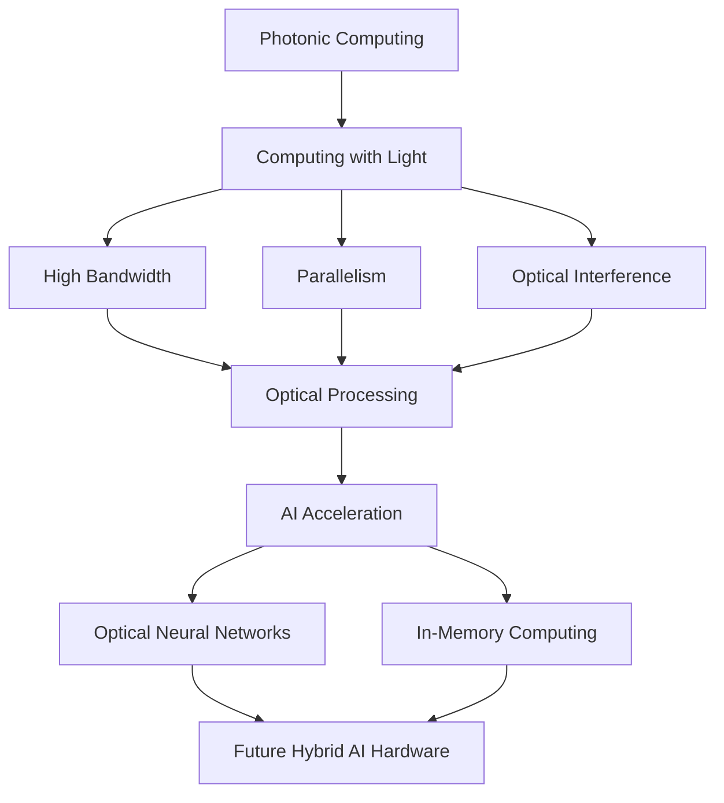

# 🔬 Day 01 — Photonic Computing

<p align="center">
  
</p>

<p align="center"><em>Photonic computing explores the use of light and optical circuits for information processing.</em></p>

> **30-Days-Tech-Research · Day 01 / 30**

**Research Date:** 29 August 2026  
**Research Area:** Artificial Intelligence · Computer Architecture · Photonics · Neuromorphic Computing  
**Research Type:** Technical Research & Literature Review  
**Author:** Jaaydeep

---

## Abstract

Artificial intelligence is increasing the demand for computing systems with high throughput, low latency and better energy efficiency. GPUs and other electronic accelerators have become central to modern AI because neural-network workloads contain large numbers of parallel mathematical operations.

At the same time, the movement of data between memory, processors and accelerators can become an important system-level limitation. Photonic computing investigates whether some of these operations can instead be represented, transmitted or processed using light.

The attraction of photonics is not simply that light travels quickly. Optical systems can exploit high bandwidth, wavelength multiplexing, spatial parallelism and interference. These properties make photonics particularly interesting for matrix operations and neural-network workloads.

Research has demonstrated optical neural networks, integrated photonic processors, neuromorphic photonic systems and photonic-memory approaches. However, photonic computing still faces substantial challenges involving optical-electrical conversion, nonlinear operations, memory, optical loss, precision, manufacturing and software integration.

This paper examines the underlying principles of photonic computing, its relevance to AI, major hardware architectures, advantages, limitations, current research directions and an open research question:

> **Instead of continuously making electronic processors faster, can some AI operations be redesigned around the physical properties of light?**

---

# 1. Introduction

Modern artificial intelligence is fundamentally a computational problem.

A neural network repeatedly performs operations such as:

- Matrix multiplication
- Vector operations
- Convolution
- Accumulation
- Nonlinear activation
- Attention
- Reduction

A simplified neural-network layer can be represented as:

\[
Y = f(WX+B)
\]

where:

- `X` = input
- `W` = model weights
- `B` = bias
- `f` = nonlinear activation
- `Y` = output

For large models, these operations are repeated at enormous scale.

This creates pressure on:

```text
Compute
   +
Memory
   +
Bandwidth
   +
Data Movement
   +
Energy
```

Therefore, improving AI hardware is not only about increasing the number of arithmetic units.

It is also about reducing the cost of moving and transforming information.

---

# 2. Why Conventional AI Hardware Uses GPUs

GPUs are highly parallel processors originally developed for graphics workloads. Their architecture became particularly useful for machine learning because many neural-network operations can be executed in parallel.

A simplified representation is:



The GPU approach is extremely mature and has a strong software ecosystem.

However, conventional electronic computing still relies heavily on moving information between different parts of the system:


As AI models become larger, memory bandwidth and data movement become increasingly important architectural considerations.

This motivates alternative approaches such as in-memory computing and photonic computing.

---

# 3. What Is Photonic Computing?

Photonic computing refers to computing systems that use photons and optical components to represent, transmit or process information.

A conventional electronic path can be simplified as:

```text
Information
     ↓
Electrical Signal
     ↓
Electronic Circuit
     ↓
Memory / Processor
     ↓
Result
```

A photonic system can introduce an optical domain:


Importantly, practical photonic computers are often **hybrid optoelectronic systems**.

They may contain:

- Electronic control circuits
- Lasers
- Optical modulators
- Waveguides
- Interferometers
- Resonators
- Photodetectors
- Electronic memory

Therefore, photonic computing should not be understood as a complete replacement of electronics.

The more useful question is:

> **Which parts of computation can benefit from being performed in the optical domain?**

---

# 4. Why Use Light?

## 4.1 High Bandwidth

Optical communication already demonstrates extremely high bandwidth.

In computing architectures, this property can potentially be used to move and process multiple information channels simultaneously.

---

## 4.2 Parallelism

Optical systems can exploit several dimensions of parallelism.

For example, multiple wavelengths can coexist:

```text
λ1 ──────────────┐
λ2 ──────────────┤
λ3 ──────────────┼──→ Photonic Processing
λ4 ──────────────┤
λ5 ──────────────┘
```

This technique is commonly associated with **wavelength-division multiplexing (WDM)**.

Other possible dimensions include:

- Spatial channels
- Wavelength
- Time
- Mode

---

## 4.3 Interference

Light waves can interfere with each other.

This physical property can be exploited to perform mathematical transformations.

```text
Light A ───────┐
               ├──→ Interference → Output
Light B ───────┘
```

With carefully designed optical circuits, interference can implement useful linear transformations.

---

# 5. Photonic Computing Pipeline

A simplified photonic AI accelerator can be represented as:



Important components include:

### Laser

Provides the optical carrier.

### Optical Modulator

Encodes information onto the optical signal.

### Waveguide

Guides light through the integrated circuit.

### Interferometer

Uses optical interference to implement programmable transformations.

### Resonator

Can manipulate optical signals according to wavelength and phase.

### Photodetector

Converts optical information back into an electrical signal.

---

# 6. Integrated Photonic Circuits

The long-term goal is not to build a large optical laboratory around every computer.

Researchers are investigating **integrated photonic circuits**, where optical components are fabricated on a chip.

Conceptually:

```text
┌───────────────────────────────────────┐
│        Photonic Integrated Chip       │
│                                       │
│ Laser → Waveguide → MZI → Detector   │
│                ↓                      │
│          Optical Processing           │
└───────────────────────────────────────┘
```

Integrated photonics aims to make optical computation:

- Smaller
- More stable
- More programmable
- More scalable
- Easier to integrate with electronics

---

# 7. Optical Neural Networks

One of the most important applications of photonic computing is the **Optical Neural Network (ONN)**.

A neural network contains many linear transformations.

A simplified layer is:

\[
Y = WX
\]

where `W` is the weight matrix and `X` is the input vector.

Matrix multiplication is an attractive target for photonic acceleration because optical interference can implement certain linear transformations in physical hardware.

Conceptually:



Research reviews identify high parallelism, low latency and potentially favorable energy characteristics as important motivations for optical neural networks.

---

# 8. Mach–Zehnder Interferometer

The **Mach–Zehnder Interferometer (MZI)** is one of the important building blocks used in integrated photonics.

A simplified representation is:

```text
                  ┌──────────────┐
Input ── Split ───┤              ├── Combine ── Output
                  │ Phase Control │
        ──────────┤              ├──────────────
                  └──────────────┘
```

The incoming light is divided into paths.

The relative phase of the paths can be controlled.

When the signals are recombined, interference changes the output.

Networks of programmable interferometers can therefore be used to implement matrix transformations.

---

# 9. Optical Matrix Multiplication

Consider:

\[
Y = WX
\]

A conventional accelerator performs this using electronic arithmetic.

A photonic architecture can encode numerical values into optical signals and use a configured optical circuit to implement a transformation.

```text
Input
  │
  ▼
┌──────────────────────┐
│ Photonic Matrix      │
│                      │
│ W11 W12 W13          │
│ W21 W22 W23          │
│ W31 W32 W33          │
│                      │
└──────────┬───────────┘
           ▼
      Output Vector
```

The weights can be represented through physical properties such as:

- Phase
- Amplitude
- Resonator response
- Interferometer configuration

The exact implementation depends on the architecture.

---

# 10. Wavelength-Division Multiplexing

A major advantage of photonic systems is the ability to use different wavelengths as separate channels.



This can provide another dimension of parallelism.

Instead of treating one optical signal as a single channel, multiple wavelengths can carry different information simultaneously.

---

# 11. Photonic Computing Is Not Simply "Faster Electricity"

A common oversimplification is:

> "Photonic computing is faster because light is faster than electrons."

That statement misses the main architectural issue.

The interesting advantages come from a combination of:

- Optical bandwidth
- Parallel channels
- Interference
- Physical matrix operations
- Specialized photonic circuits
- Potentially reduced data movement
- Integration with memory

System-level performance also depends on:

- Modulators
- Detectors
- Lasers
- Memory
- Electronic control
- Converters
- Communication interfaces

Therefore, the correct comparison must be made at the **complete system level**, not only by comparing propagation speed.

---

# 12. The Data-Movement Problem

A simplified conventional architecture looks like:


The processor and memory are separate.

AI workloads can require repeated movement of:

- Model parameters
- Activations
- Intermediate tensors
- Gradients

This creates a fundamental architectural question:

> **Why move data to the computation if some computation can instead move closer to the data?**

This is one of the motivations behind **in-memory computing**.

---

# 13. Photonic In-Memory Computing

Conventional architecture:

```text
Memory
   ↓
Move Data
   ↓
Compute
   ↓
Move Result
   ↓
Memory
```

In-memory computing attempts to reduce this separation:

```text
┌─────────────────────────────┐
│                             │
│      MEMORY + COMPUTE       │
│                             │
└─────────────────────────────┘
```

Photonic in-memory computing extends the concept into the optical domain.

The goal is not simply to make the optical calculation fast.

The larger goal is to reduce unnecessary movement between:

```text
Memory ↔ Compute ↔ Memory
```

This is an active research direction.

---

# 14. Why Memory Is Difficult for Photonics

Photonic processing can perform useful transformations, but AI systems still need to store information.

For example:

```text
Model
 ↓
Weights
 ↓
Memory
 ↓
Compute
```

If an optical processor is very fast but constantly waits for memory or conversion hardware, the theoretical optical advantage can be reduced.

This is why photonic memory and hybrid photonic-electronic memory architectures are important.

---

# 15. Neuromorphic Photonic Computing

Neuromorphic computing is inspired by principles found in biological neural systems.

Common concepts include:

- Spiking neurons
- Event-driven processing
- Local memory
- Distributed computation
- Neural dynamics

Photonic hardware can be combined with neuromorphic approaches:



The objective is not to recreate the human brain exactly.

The objective is to use useful computational principles to build efficient hardware.

---

# 16. Analog Memory + Photonic Computing

Recent research has investigated neuromorphic photonic computing combined with electro-optic analog memory.

The underlying idea is important:

```text
Photonic Compute
       +
Analog Memory
       ↓
Less repeated data movement
```

A conventional pipeline might require repeated conversion:

```text
Memory
  ↓
DAC
  ↓
Photonic Compute
  ↓
ADC
  ↓
Memory
```

An integrated approach attempts to bring memory closer to the computation.

This research direction is particularly relevant to the broader question of how computation and memory should be physically organized.

---

# 17. Photonic Neural-Network Chips

The field is moving from individual optical components toward complete integrated neural-network chips.

Recent work has demonstrated programmable photonic neural-network hardware for matrix operations and image processing.

The overall research progression can be summarized as:


This progression matters because laboratory demonstrations and deployable computing systems have very different requirements.

---

# 18. Photonic Tensor Processing

Deep-learning models operate heavily on tensors.

A photonic tensor processor attempts to accelerate tensor operations using optical hardware.

A simplified architecture is:

```text
PyTorch / AI Framework
          ↓
Hardware Interface
          ↓
Photonic Tensor Processor
          ↓
Optical Computation
          ↓
Inference Result
```

Integration with existing AI frameworks is important.

A photonic accelerator becomes much more practical if developers can use familiar software instead of learning an entirely separate programming environment.

---

# 19. Advantages of Photonic Computing

## 19.1 Parallelism

Multiple optical channels can be processed simultaneously.

## 19.2 High Bandwidth

Photonics provides access to very high-bandwidth optical communication and processing.

## 19.3 Low Latency Potential

Some optical transformations can occur with extremely small physical propagation delays.

## 19.4 Potentially Reduced Data Movement

Architectures that combine computation and memory may reduce unnecessary transfers.

## 19.5 AI Acceleration

Photonic hardware is particularly attractive for workloads involving:

- Matrix multiplication
- Linear transformations
- Convolution
- Signal processing
- Neural-network inference

---

# 20. Major Limitations

Photonic computing is promising, but it is not a universal replacement for electronic computing.

## 20.1 Optical-Electrical Conversion

Many practical systems still require:

```text
Electrical
    ↓
Optical
    ↓
Processing
    ↓
Electrical
```

Converters can introduce:

- Energy consumption
- Latency
- Hardware complexity

---

## 20.2 Nonlinear Operations

Neural networks require nonlinear functions.

Optical systems naturally support many linear transformations, but efficient nonlinear processing remains a major research challenge.

---

## 20.3 Optical Loss

Real optical systems experience:

- Waveguide loss
- Coupling loss
- Scattering
- Absorption
- Component imperfections

Loss can become more difficult to manage as systems scale.

---

## 20.4 Noise and Precision

Real optical systems can be affected by:

- Thermal variation
- Laser noise
- Detector noise
- Fabrication variation
- Device drift

These factors can affect numerical accuracy.

---

## 20.5 Memory

Scalable memory remains one of the hardest parts of building complete photonic computers.

---

## 20.6 Software Ecosystem

GPU computing has an extremely mature ecosystem.

Photonic computing still needs stronger:

- Compilers
- Libraries
- Runtime systems
- Model conversion tools
- Debugging tools
- Hardware abstractions

---

## 20.7 Manufacturing

Integrated photonic systems require precise fabrication.

Scaling a laboratory prototype into reliable mass-produced hardware is a separate challenge.

---

# 21. Photonic Computing vs GPU

It would be misleading to claim that photonic computing is simply "better" than GPUs.

| Feature | GPU | Photonic Computing |
|---|---|---|
| Technology maturity | Very high | Emerging |
| AI software ecosystem | Excellent | Developing |
| General-purpose flexibility | High | Limited |
| Parallelism | Very high | Potentially very high |
| Optical bandwidth | No | Yes |
| Matrix operations | Excellent | Promising |
| Memory ecosystem | Mature | Developing |
| Nonlinear operations | Mature | Challenging |
| Precision | High | Architecture-dependent |
| Manufacturing | Mature | Developing |
| AI inference | Excellent | Emerging |
| Large-scale deployment | Established | Early-stage |

The practical future may therefore be **hybrid** rather than either/or.

---

# 22. A Possible Heterogeneous AI Architecture

Instead of asking:

> "How do we replace the GPU?"

a more realistic architecture may use several computing substrates.



Different hardware could specialize in different tasks:

```text
Photonic Hardware
→ Optical linear transformations

NPU
→ Efficient local AI operations

GPU
→ Large parallel workloads

CPU
→ Control and general computation

Memory
→ Model parameters and state
```

This is a more realistic direction than assuming one technology will replace everything.

---

# 23. Research Gap

Photonic computing is already an established research field.

Therefore, this statement would **not** be a novel research claim:

> "AI can be computed using light."

That has already been demonstrated in multiple forms.

The more interesting research questions are architectural.

### Possible research gaps

1. How can photonic computation scale to larger AI models?
2. How can optical memory scale with model size?
3. How can nonlinear operations be implemented efficiently?
4. How can optical-electrical conversion overhead be minimized?
5. How can photonic hardware integrate with existing AI frameworks?
6. How can photonic and electronic accelerators cooperate?
7. Can sensing, memory and computation be integrated into one system?
8. What is the true end-to-end energy efficiency of a complete photonic AI system?

---

# 24. Researcher's Observation

After reviewing the literature, the question:

> "Can AI run without a GPU?"

appears too narrow.

A more interesting question is:

> **"Can we change where AI computation happens?"**

A conventional architecture can be simplified as:

```text
Sensor
  ↓
Memory
  ↓
Processor
  ↓
Memory
  ↓
Output
```

A future architecture could attempt to bring some of these operations closer together:

```text
┌─────────────────────────────────┐
│ Sensor + Memory + Computation   │
└─────────────────────────────────┘
```

Photonic computing is one possible path toward this direction.

This is a conceptual observation, not a claim that a complete architecture already exists.

---

# 25. Working Hypothesis

> **AI systems may achieve better system-level efficiency when sensing, memory and computation are co-designed around the physical properties of the hardware rather than being treated as completely independent stages.**

Photonic computing could provide one computational layer in such a system.

This hypothesis requires experimental validation.

---

# 26. Proposed Conceptual Architecture

The following is a personal conceptual model based on the literature reviewed in this research.



The idea is not to remove every electronic processor.

Instead:

> **Use each physical computing substrate for the operation where it is most efficient.**

---

# 27. Potential Applications

## Artificial Intelligence

- Neural-network inference
- Computer vision
- Pattern recognition
- Signal processing

## Edge AI

- Autonomous systems
- Robotics
- Sensor processing
- Real-time perception

## Data Centers

- AI acceleration
- High-bandwidth processing
- Optical interconnects

## Communications

- Optical signal processing
- High-speed data processing

## Scientific Computing

- Specialized mathematical operations
- Signal analysis
- Optimization

These are potential application areas rather than guaranteed outcomes.

---

# 28. Open Research Questions

### Q1

Can photonic hardware efficiently run transformer-style workloads?

### Q2

Can photonic memory scale to very large AI models?

### Q3

Can nonlinear neural-network operations be implemented optically without excessive electronic overhead?

### Q4

Can a photonic accelerator work alongside a GPU without creating a new communication bottleneck?

### Q5

Can sensors directly feed photonic computation without converting all information into conventional digital representations first?

### Q6

What happens when computation, memory and sensing are designed together from the beginning?

---

# 29. Conclusion

Photonic computing is not simply an attempt to make an electronic computer faster.

It represents a different way of thinking about computer architecture.

Instead of relying exclusively on electrical signals, photonic systems use properties of light such as:

- Optical bandwidth
- Interference
- Wavelength
- Spatial parallelism
- Fast signal propagation

to perform or accelerate selected computational operations.

The field has progressed from theoretical optical computing toward integrated photonic neural networks, photonic tensor processors, neuromorphic photonic systems and photonic-memory research.

At the same time, important challenges remain:

- Optical-electrical conversion
- Nonlinear operations
- Memory
- Optical losses
- Noise
- Manufacturing
- Software
- Scalability

Therefore, it is premature to describe photonic computing as a replacement for GPUs.

A more realistic possibility is a heterogeneous future in which:

```text
CPU
 +
GPU
 +
NPU
 +
Photonics
 +
Memory
 +
Sensors
```

work together.

The most interesting question may therefore not be:

> **"Can light replace the GPU?"**

but:

> **"Which parts of AI computation should be performed using light?"**

That question opens a much larger research space.

---

# 30. Key Takeaways



### One-line takeaway

> **The future of AI hardware may not be about building one faster processor; it may be about choosing the right physical medium for each part of computation.**

---

# 31. Research Status

**Day:** 01 / 30  
**Topic:** Photonic Computing  
**Status:** Completed  
**Research Type:** Literature Review + Personal Research Hypothesis

### Researcher's Note

The observations and proposed architecture in Sections 24–26 are conceptual and should not be interpreted as established experimental results.

Existing research has already demonstrated multiple forms of photonic and optical neural computation. The purpose of this research is to understand the field and identify questions that may lead to future experimentation.

---

# 32. References & Resources

## Primary Research

### 1. Optical Neural Networks: Progress and Challenges

T. Fu et al., *Light: Science & Applications*, 2024.

Covers optical neural-network architectures, optical components, advantages and major challenges.

**Paper:**  
https://www.nature.com/articles/s41377-024-01590-3

---

### 2. Integrated Photonic Neuromorphic Computing: Opportunities and Challenges

N. Farmakidis, B. Dong & H. Bhaskaran, *Nature Reviews Electrical Engineering*, 2024.

Useful for understanding optical nonlinearities, electro-optical conversion, amplification and photonic neuromorphic architectures.

**Paper:**  
https://www.nature.com/articles/s44287-024-00050-9

**DOI:**  
https://doi.org/10.1038/s44287-024-00050-9

---

### 3. Neuromorphic Photonic Computing with an Electro-Optic Analog Memory

S. Lam et al., *Nature Communications*, 2026.

Relevant to photonic computing, analog memory and data movement.

**Paper:**  
https://www.nature.com/articles/s41467-026-69084-x

**PubMed:**  
https://pubmed.ncbi.nlm.nih.gov/41654493/

---

### 4. Programmable Three-Dimensional Photonic Neural Network Chip

Z. Cao et al., *Nature Communications*, 2026.

Reports a programmable 3D photonic neural-network chip and image-processing demonstrations.

**Paper:**  
https://www.nature.com/articles/s41467-026-72316-9

---

### 5. Deep Neural Network Inference on an Integrated Photonic Tensor Processor

L. Meyer et al., *Nature Communications*, 2026.

Relevant to photonic tensor processing and integration with conventional AI software.

**Paper:**  
https://www.nature.com/articles/s41467-026-71599-2

---

### 6. Integrated Platforms and Techniques for Photonic Neural Networks

H. Zhang et al., *npj Nanophotonics*, 2025.

Useful for understanding integrated photonic neural-network platforms.

**Paper:**  
https://www.nature.com/articles/s44310-025-00088-z

---

### 7. Scaling Up for End-to-End On-Chip Photonic Neural Network Inference

B. Wu et al., 2025.

Discusses end-to-end photonic neural-network inference and scaling challenges.

**Paper:**  
https://www.nature.com/articles/s41377-025-02029-z

---

### 8. Photonic Neuromorphic Accelerator for Convolutional Neural Networks

A. Tsirigotis et al., 2025.

Discusses an integrated photonic neuromorphic accelerator based on a programmable waveguide mesh.

**Paper:**  
https://www.nature.com/articles/s44172-025-00416-3

---

### 9. Energy-Efficient Photonic Memory Based on Electrically Programmable Phase-Change Materials

S. Cheung et al., 2024.

Useful for understanding photonic memory and phase-change-material approaches.

**Paper:**  
https://www.nature.com/articles/s44172-024-00197-1

---

### 10. Nanoscience at the Centre of Optical Computing

*Nature Nanotechnology*, 2026.

Discusses opportunities and practical limitations of nanoscale optical computing.

**Paper:**  
https://www.nature.com/articles/s41565-026-02124-1

---

# 33. Suggested Reading Order

```text
Optical Neural Networks
        ↓
Integrated Photonics
        ↓
Mach–Zehnder Interferometers
        ↓
Optical Matrix Multiplication
        ↓
Photonic Memory
        ↓
Neuromorphic Photonics
        ↓
Photonic AI Accelerators
        ↓
Future Heterogeneous Architectures
```

---

# 34. Final Research Statement

> **This Day 01 research does not claim that photonic computing will replace GPUs. It investigates whether the physical medium and architecture used for AI computation can be redesigned, and identifies photonic computing as one of the interesting directions toward that possibility.**

---

<p align="center">

### 🔬 30-Days-Tech-Research

**Day 01 / 30**

**Research → Understand → Question → Explore → Document**

</p>
